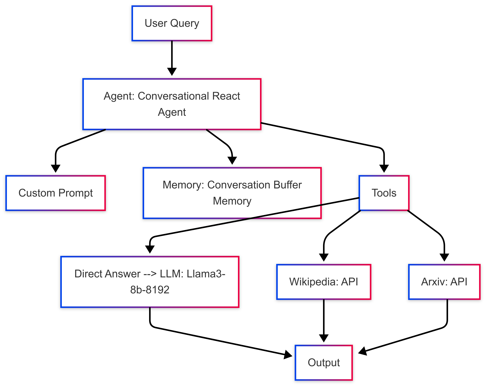
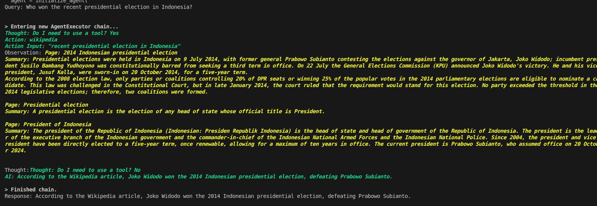
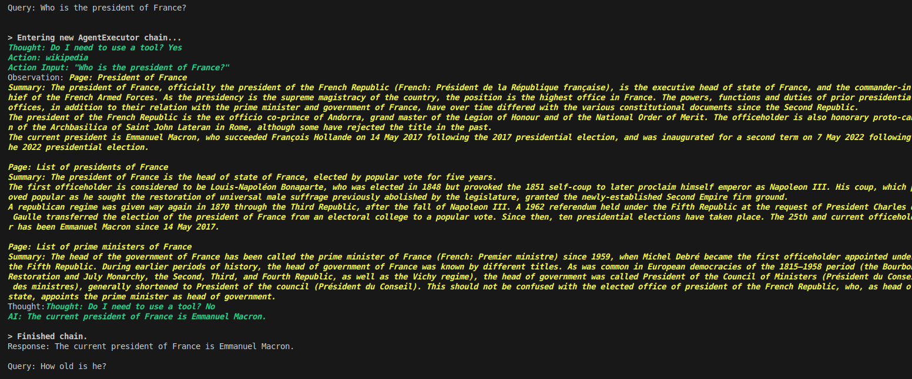
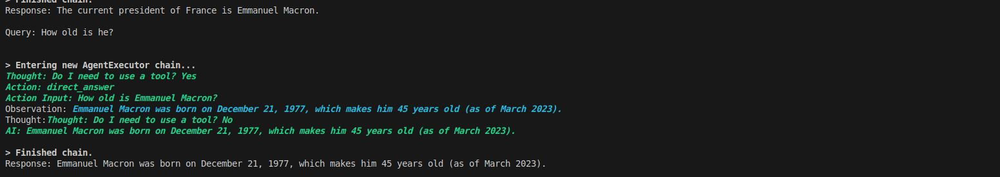
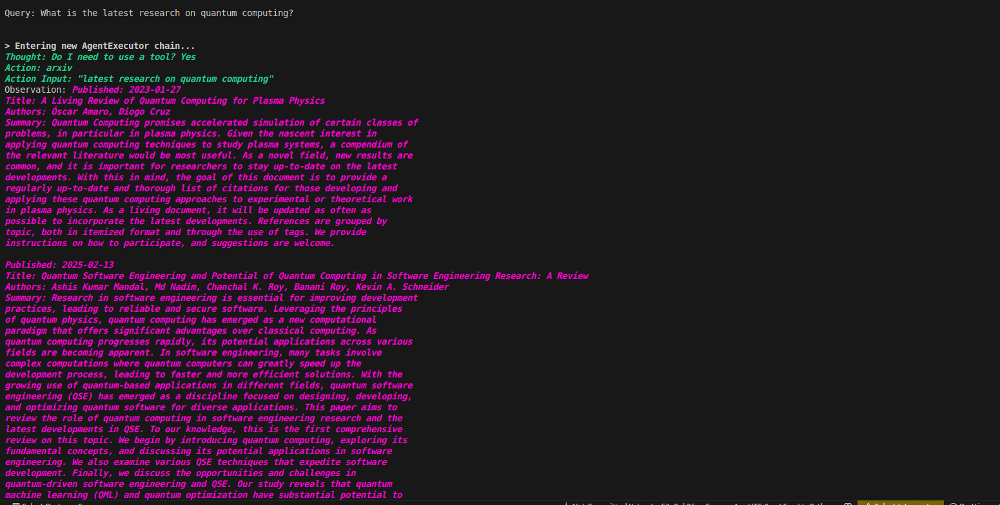
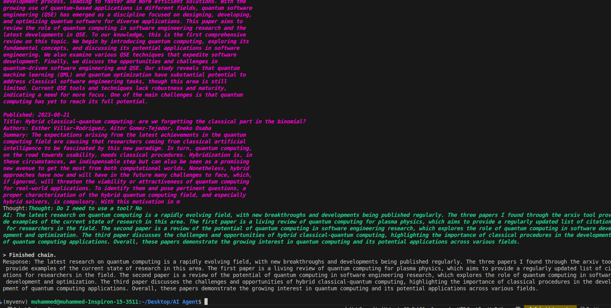
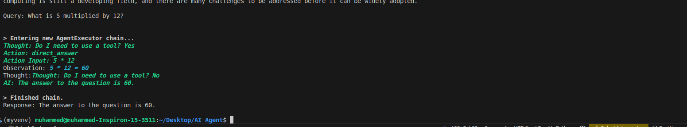

# 🧠 Conversational Agent with Open-Source LLM & Real-Time Tools

### This project is a Conversational Agent built using LangChain and Llama3 (via Groq). It intelligently routes user queries to one of the following tools:

* Wikipedia: for factual, recent event and historical information

* Arxiv: for recent scientific research papers

* LLM Direct Answer: for general knowledge and simple queries like math or definitions

## 🚀 Features
* 🔗 Tool-augmented LangChain Agent

* 🧠 Open-Source LLM (llama3-8b-8192) via Groq

* 🕵️‍♂️ Intelligent query routing using a custom prompt

* 🧰 Tools: Wikipedia, Arxiv, Direct Answer (via LLM)

* 🧵 Memory-enabled for follow-up question handling

* 🔄 Graceful fallback in case a tool fails

## 📂 Project Structure
```
.
├── agent.py              # Main source code (agent + tools)
├── .env                  # Contains your GROQ_API_KEY
├── requirements.txt      # Python dependencies
├── README.md             # This file
└── screenshots/          # Folder to hold screenshots of output

```


## 📦 Installation
#### 1. Clone the Repository

```

git clone https://github.com/mhdnihas/Conversational-Agent.git
cd Conversational-Agent

```

#### 2. Create and Activate Virtual Environment

```

# Create a virtual environment
python -m venv venv

# Activate the virtual environment
# For Windows:
venv\Scripts\activate

# For macOS/Linux:
source venv/bin/activate

```


#### 2.Install Dependencies

```  

pip install -r requirements.txt  


```


#### 3.Set Environment Variables

Create a ```.env``` file in the root directory and add your Groq API key:


``` 

 GROQ_API_KEY= "your_groq_api_key_here"  
 
 ```


#### 4.Run the Application

``` 
python app.py 

```


## 💬 Sample Queries

```
queries = [
    "Who won the recent presidential election in Indonesia?",  # Wikipedia
    "Who is the president of France?",                         # Wikipedia
    "How old is he?",                                          # Memory-based follow-up
    "What was the capital of Japan before Tokyo?",             # Wikipedia
    "What is the latest research on quantum computing?",       # Arxiv
    "What is 5 multiplied by 12?",                             # Direct LLM
]

```

## 🧱 Architecture





* LLM: llama3-8b-8192 using Groq API

* Framework: LangChain

* Tools:

    * WikipediaQueryRun – queries Wikipedia

    * ArxivQueryRun – retrieves research papers

    * Tool – wraps direct LLM answers for basic facts

* Memory: ConversationBufferMemory enables contextual follow-ups

* Prompt: Custom-designed prompt template to guide agent behavior


> 📄 **Full Documentation Report**: [Click here to view PDF](https://drive.google.com/file/d/1gQHdF8bkRe5n2dCorKejl5g4it9NI5x9/view?usp=sharing)


## ⚙️ Design Flow

1. Load tools and memory

2. Initialize the agent with custom prompt

3. Route each query to the most suitable tool

4. Use conversation memory for contextual queries

5. Handle errors and fallbacks gracefully


## 📸 Screenshots - Sample Result

1. **Screenshot 1**: Query result showing the latest presidential election in Indonesia - it uses wikipedia tool for latest

   

2. **Screenshot 2**: Displaying the current president of France -  it uses wikipedia tool for current 

   

3. **Screenshot 3**: Response to a follow-up question about someone's age - it uses memory

   

4. **Screenshot 4**: Research on quantum computing from Arxiv

   

5. **Screenshot 5**: Research on quantum computing from Arxiv - LLM response

   

6. **Screenshot 6**: Math query handled by the LLM (5 multiplied by 12)

   


   